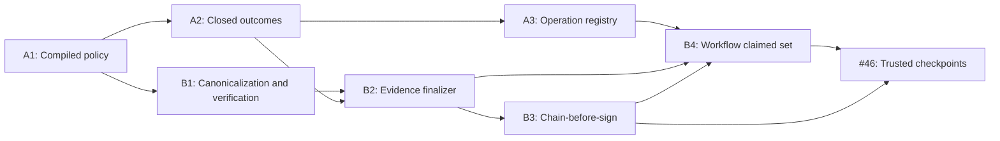

# Enforcement-Core Remediation Plan Index

Date: 2026-07-30

Architecture: [Enforcement-Core Security Remediation Design](../specs/2026-07-30-enforcement-core-security-remediation-design.md)

Status: Approved architecture; implementation plans ready for execution review

## Execution graph

After A1, A2 must land before either A3 or B2. A3 and B2 may then execute in
parallel because they modify different state boundaries, subject to normal
conflict review in `enforcement.py` and `session.py`. B3 follows B2. B4 is the
convergence slice and begins only after A3 and B3.

## Plans

| Order | Plan | Primary findings/issues | Required predecessor |
|---|---|---|---|
| 1 | [A1 — Compiled policy and restriction envelope](2026-07-30-a1-compiled-policy-restriction-envelope.md) | #53, #54, #56, composition/guard widening, undeclared risk conditions, runtime risk downgrade | Approved architecture |
| 2 | [A2 — Closed outcomes and gate projections](2026-07-30-a2-closed-outcome-gate-projection.md) | #55, `_ImmutableView._data`, empty-failure gate bypass, fixed critical ceiling | A1 |
| 3A | [A3 — Process-affine operation registry](2026-07-30-a3-process-affine-operation-registry.md) | replay TOCTOU, process/instance affinity | A2 |
| 3B | [B1 — Canonicalization, checksum, and verification](2026-07-30-b1-canonicalization-checksum-verification.md) | #50, canonicalization collisions, host-only legacy modes | A1 interface freeze |
| 4 | [B2 — Evidence finalizer and workflow signing](2026-07-30-b2-evidence-finalizer-workflow-signing.md) | #51, fail-closed sink delivery, minimum attempt identity | A2 and B1 |
| 5 | [B3 — Chain-before-sign linker](2026-07-30-b3-chain-before-sign-linker.md) | #52, content-checksum linker contract | B2 |
| 6 | [B4 — Workflow claimed-set metadata](2026-07-30-b4-workflow-completeness-metadata.md) | atomic step indices, signed count/order, typed claimed-set verification | A3 and B3 |
| 7 | #46 trusted checkpoint implementation plan | externally proven completeness and divergence | B3 and B4 contracts frozen |

## Release and review gates

- Every task follows red-green TDD and ends with an independently reviewable
  commit.
- Each slice runs its focused completion gate and the entire pytest suite.
- `security-boundaries.yml` is a blocking protected-branch and release check.
- Root and packaged schemas must remain byte-for-byte identical.
- No later plan may implement or mutate an upstream interface without updating
  the approved architecture and every dependent plan.
- #46 planning begins only after B3/B4 verification vectors are stable.

After the core slices:

- #38 consumes the completed invariant harness for adapter conformance.
- #42 may begin after A1 freezes the compiled provider boundary; CEL remains
  blocked until #42 is complete.
- #47 and the remaining #39 acceptance criteria follow #46.

## Separately tracked hardening

These P1 issues are deliberately outside the A/B implementation scope:

- [#57 — policy-root containment](https://github.com/nealsolves/aegis/issues/57)
- [#58 — audit-file permissions and symlink hardening](https://github.com/nealsolves/aegis/issues/58)
- [#59 — demo resource and diagnostic controls](https://github.com/nealsolves/aegis/issues/59)

They require their own implementation plans. Their fixes must not be smuggled
into an enforcement-core slice unless the architecture dependency graph is
explicitly revised.
