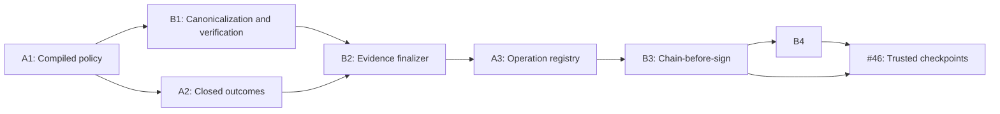

# Enforcement-Core Remediation Plan Index

Date: 2026-07-30

Architecture: [Enforcement-Core Security Remediation Design](../specs/2026-07-30-enforcement-core-security-remediation-design.md)

Status: Approved architecture; adversarial plan corrections incorporated,
renewed execution approval required

## Execution graph

After A1, A2 and B1 may proceed independently. They converge at B2. From B2
onward the merge order is explicit and serialized: **B2 → A3 → B3 → B4**.
A3 and B2 may not execute in parallel: they share the live Phase A/B paths,
session state, errors, boundary tests, and integration documentation. B3 also
touches the finalizer/enforcement seam, so it starts only after A3 lands. No
executor may reorder these slices based on their conceptual track labels.

## Plans

| Order | Plan | Primary findings/issues | Required predecessor |
|---|---|---|---|
| 1 | [A1 — Compiled policy and restriction envelope](2026-07-30-a1-compiled-policy-restriction-envelope.md) | #53, #54, #56, composition/guard widening, undeclared risk conditions, runtime risk downgrade | Approved architecture |
| 2 | [A2 — Closed outcomes and gate projections](2026-07-30-a2-closed-outcome-gate-projection.md) | #55, `_ImmutableView._data`, empty-failure gate bypass, fixed critical ceiling | A1 |
| 3 | [B1 — Canonicalization, checksum, and verification](2026-07-30-b1-canonicalization-checksum-verification.md) | #50, five-axis verification, canonicalization collisions, host-only legacy modes, schema/golden/demo migration | A1 canonicalization/profile interface freeze |
| 4 | [B2 — Evidence finalizer and workflow signing](2026-07-30-b2-evidence-finalizer-workflow-signing.md) | #51, module and instance fail-closed sink delivery, minimum attempt identity | A2 and B1 |
| 5 | [A3 — Process-affine operation registry](2026-07-30-a3-process-affine-operation-registry.md) | replay TOCTOU, process/instance affinity, deletion of portable-token machinery | B2 |
| 6 | [B3 — Chain-before-sign linker](2026-07-30-b3-chain-before-sign-linker.md) | #52, content-checksum linker contract, bounded reservation recovery | A3 |
| 7 | [B4 — Workflow claimed-set metadata](2026-07-30-b4-workflow-completeness-metadata.md) | atomic step indices, allocated-count claim, typed claimed-set verification | B3 |
| 8 | #46 trusted checkpoint implementation plan | externally proven completeness and divergence | B3 and B4 contracts frozen |

## Release and review gates

- Every task follows red-green TDD and ends with an independently reviewable
  commit.
- Each slice runs its focused completion gate and the entire pytest suite.
- `security-boundaries.yml` is a blocking protected-branch and release check.
- A1 owns the required Python 3.10–3.14 ×
  Ubuntu/macOS/Windows `google-re2` smoke matrix. The supported-environment
  claim cannot expand beyond passing lanes.
- Root and packaged schemas must remain byte-for-byte identical.
- A schema-version change and its fixtures/goldens/consumer migrations land in
  the same commit. B1 owns the audit/workflow 2.0 corpus migration and the demo
  `verify_chain_detailed()` consumer.
- No later plan may implement or mutate an upstream interface without updating
  the approved architecture and every dependent plan.
- #46 planning begins only after B3/B4 verification vectors are stable.

After the core slices:

- #38 consumes the completed invariant harness for adapter conformance.
- #42 may begin after A1 freezes the compiled provider boundary; CEL remains
  blocked until #42 is complete.
- #47 and the remaining #39 acceptance criteria follow #46.

## Separately tracked hardening

These P1 issues are deliberately outside the A/B implementation scope:

- [#57 — policy-root containment](https://github.com/nealsolves/aegis/issues/57)
- [#58 — audit-file permissions and symlink hardening](https://github.com/nealsolves/aegis/issues/58)
- [#59 — demo resource and diagnostic controls](https://github.com/nealsolves/aegis/issues/59)

They require their own implementation plans. Their fixes must not be smuggled
into an enforcement-core slice unless the architecture dependency graph is
explicitly revised.
