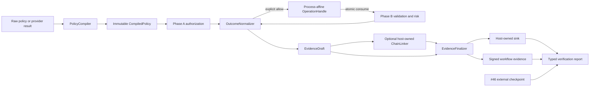

# Enforcement-Core Security Remediation Design

Date: 2026-07-30
Status: Revised after adversarial review; awaiting final approval
Scope: Architecture and roadmap only; no remediation implementation

## Executive decision

AEGIS will remediate the enforcement-core review through two coordinated
security tracks:

1. **Authorization integrity** — compile policies into a closed, immutable
   enforcement representation; compare every composition and guard effect
   against a non-widening authority envelope; normalize gates, hooks, risk, and
   split-operation state into explicit fail-closed outcomes.
2. **Evidence integrity** — make checksums mandatory, route every artifact
   through one finalizer, attach chain coordinates before signing, and keep
   workflow evidence separately signed and externally anchorable.

This is not a rewrite. Existing public entry points remain recognizable, but
unsafe beta behavior is deliberately rejected. No production application is
currently relying on AEGIS, so the design chooses security corrections over
preserving permissive behavior.

The next implementation plan must treat the following issues as design
dependencies rather than independent patches:

- [#50 — checksum stripping and unqualified completeness](https://github.com/nealsolves/aegis/issues/50)
- [#51 — unsigned workflow and failure artifacts](https://github.com/nealsolves/aegis/issues/51)
- [#52 — sign-before-chain ordering](https://github.com/nealsolves/aegis/issues/52)
- [#53 — typed-precondition type confusion](https://github.com/nealsolves/aegis/issues/53)
- [#54 — non-finite risk values](https://github.com/nealsolves/aegis/issues/54)
- [#55 — ValidatorHook execution-failure authorization](https://github.com/nealsolves/aegis/issues/55)
- [#56 — external JSON Schema reference retrieval](https://github.com/nealsolves/aegis/issues/56)

The design also incorporates the already-reviewed enforcement findings for
guard/composition widening, custom-gate fail-open behavior, undeclared risk
conditions, runtime risk downgrades, the fixed critical-risk ceiling, and
process-affine single-use split tokens.

## Goals

- Make a loaded policy an enforceable security contract rather than a raw
  dictionary that later stages reinterpret.
- Give custom gates detached immutable projections with no argument-reachable
  handle to live invocation or policy state.
- Prove that composition, runtime overrides, and guard expansion cannot widen
  authority.
- Continue only after an explicit allow-class result.
- Make a risk score at or above `0.90` block in every risk mode.
- Make split-operation authorization single-use, atomic, instance-bound, and
  process-affine without token-expiry logic.
- Ensure every PASS and FAIL artifact reaches exactly one checksum, signing,
  and emission boundary.
- Make canonicalization injective over the accepted normalized JSON data model,
  versioned, and identical before checksum, signing, emission, and verification.
- Prevent a configured evidence-delivery failure from returning an allow-class
  result.
- Make invocation-chain linkage signature-covered without making AEGIS own
  global evidence ordering or storage.
- Keep workflow evidence separate from invocation chains while signing its
  claimed step set and order.
- Report internal integrity and externally proven completeness as different
  verification properties.
- Establish dependency order for #38, #39, #42, #46, and #47.

## Non-goals

- Distributed or cross-process split-token handoff.
- Automatic token renewal or wall-clock token expiration.
- AEGIS-owned global invocation-chain ordering.
- AEGIS-owned evidence storage, WORM lifecycle, cloud credentials, or KMS
  networking.
- A general expression language such as CEL.
- A distributed state provider.
- Automatic remote or filesystem retrieval of JSON Schemas.
- Proof that a host disclosed every invocation without an external checkpoint.
- Demo rate limiting, HTTP body limits, YAML alias limits, sink file
  permissions, or policy-root path containment. Those remain separate
  hardening work even where they reuse compiler/finalizer utilities.

## Approaches considered

### Chosen: two security boundaries with staged migration

Introduce a compiled-policy boundary and a central evidence-finalization
boundary, then route existing enforcement modes through them.

Advantages:

- Fixes root causes shared by multiple findings.
- Preserves host ownership of storage and ordering.
- Allows small, reviewable pull requests along explicit dependency edges.
- Gives #38 and #42 stable contracts to consume.
- Avoids adding cloud or state dependencies to the core package.

Cost:

- Requires narrow internal data models and replacement of scattered dict
  interpretation.
- Requires a breaking beta migration for ambiguous policies, transferable
  split results, and legacy verification defaults.

### Rejected: patch each reported line in place

This would add checks around the current raw dictionaries and scattered sink
calls. It is smaller per issue but leaves future fields outside the restriction
allowlist, leaves new terminal outcomes prone to denylist mistakes, and cannot
make signing-before-emission structurally mandatory.

### Rejected: enforcement and storage rewrite

Making AEGIS own chains, storage, session registries, and distributed state
would eliminate some integration ambiguity, but it changes the product
boundary and creates ordering, availability, credential, and concurrency
responsibilities that belong to hosts.

### Chosen for policy patterns: required Google RE2 engine

Policy-supplied patterns use the official `google-re2` Python package. RE2
guarantees match time linear in input length, bounds its working memory, accepts
common repetition and alternation, and rejects constructs that require
backtracking such as backreferences and lookaround.

This adds one native runtime dependency and requires wheel coverage in the
supported-environment matrix. That cost is accepted because patterns are
untrusted executable policy and the current Python `re` engine does not offer a
match timeout or a linear-time guarantee.

References:

- [Google RE2](https://github.com/google/re2)
- [Official google-re2 Python package](https://pypi.org/project/google-re2/)

### Rejected for policy patterns: handwritten stdlib safety lint

A rule that rejects quantified groups, nested quantifiers, backreferences, and
lookaround admits useful syntax, but it is not a complete proof against
backtracking blowups. Multiple adjacent ambiguous quantifiers can still create
severe backtracking without a quantified group. A stricter handwritten subset
would reject ordinary safe idioms and require AEGIS to maintain its own regex
parser and complexity proof. Lint remains useful for migration diagnostics, but
it is not the runtime security boundary.

## Target architecture

The implementation is divided into seven internal units with one responsibility
each:

1. `PolicyCompiler` validates and compiles policy semantics.
2. `RestrictionComparator` proves that a candidate is not weaker than its
   authority envelope.
3. `GateProjectionFactory` creates detached immutable gate inputs.
4. `OutcomeNormalizer` maps all gates, hooks, risk evaluations, and internal
   failures into a closed authorization result.
5. `OperationRegistry` owns atomic single-use split-operation state.
6. `CanonicalizationProfileV2` normalizes and serializes the accepted JSON
   evidence model.
7. `EvidenceFinalizer` owns checksum, signature, and emission ordering.

These units may initially remain internal. Public types are added only when a
host integration cannot be expressed through the existing `AEGIS` surface.

## 1. Policy compilation boundary

### Input and output

Every enforcement path receives a `CompiledPolicy`, never a policy-shaped raw
mapping. The compiler accepts:

- a parsed root policy;
- resolved parent policies;
- an optional custom policy-provider result;
- a declared source identity used for evidence;
- the compiler resource limits.

It returns an immutable deep snapshot containing:

- policy and source digests;
- normalized roles and tool constraints;
- compiled typed preconditions;
- a safe Draft 7 output validator;
- compiled guards and declared conditions;
- normalized risk rules;
- workflow constraints;
- the closed canonicalization profile identifier;
- an authority envelope used for later comparisons.

No enforcement stage reopens, reloads, merges, or converts the raw policy.
Phase B carries the exact `CompiledPolicy` authorized in Phase A.

### Compilation phases

The compiler performs these phases in order:

1. Structural policy-schema validation.
2. Semantic primitive validation.
3. Parent resolution and composition.
4. Restriction comparison at every composition edge.
5. Guard expression and guard-effect compilation.
6. Typed-precondition compilation.
7. RE2 pattern compilation.
8. Safe output-schema compilation.
9. Risk-condition resolution and numeric normalization.
10. Workflow constraint normalization.
11. Immutable snapshot and digest construction.

Any error stops compilation. Lint uses the same compiler in diagnostic mode so
lint and runtime cannot disagree about policy validity.

### Typed preconditions: #53

Type-specific keywords require an explicit compatible type:

- `pattern`, `minLength`, and `maxLength` require `type: string`.
- `minimum` and `maximum` require `type: number` or `type: integer`.
- Incompatible combinations are rejected.
- The compiler does not infer a missing type.
- A typed precondition with no semantic constraint is rejected rather than
  reverting to a different truthiness rule.
- A satisfied-preconditions evidence entry is added only after the compiled
  validator evaluated the value successfully.

Legacy bare-string preconditions remain parseable only through an explicit
legacy-policy mode. Strict compilation rejects them. Legacy mode preserves
the existing truthiness behavior and records that legacy semantics were used.

### Linear-time pattern engine

Policy-supplied regular expressions are executable input and output validators,
so lint warnings alone are insufficient. Typed preconditions and every
pattern-bearing output-schema location, including `pattern` and
`patternProperties`, use the same RE2 compiler.

- maximum encoded pattern length is `256` UTF-8 bytes;
- maximum candidate value is `16_384` UTF-8 bytes;
- RE2-supported repetition, grouping, and alternation are accepted;
- unsupported backreferences, lookaround, and other non-RE2 constructs fail
  policy compilation;
- patterns compile once and runtime never evaluates an uncompiled policy
  string;
- a candidate exceeding the runtime bound fails closed with
  `PATTERN_INPUT_TOO_LARGE`;
- precondition candidates map that code to `PreconditionError`;
- output-schema candidates map it to `SchemaValidationError`.

The common patterns `^[A-Za-z0-9._-]+$` and
`^(APPROVED|REJECTED)$` remain valid. Documentation recommends `enum` instead
of alternation when the policy represents a finite set of literal choices.
Workflow lint reports the exact policy/schema path and unsupported construct.

The `google-re2` package is required by the policy compiler. Import or engine
initialization failure is a policy-compilation failure, never a fallback to
Python `re`.

### Finite security numbers: #54

One strict numeric primitive validator is used for every security score,
threshold, factor weight, retry count, timeout, and limit.

It rejects:

- booleans;
- numeric strings;
- `NaN`;
- positive and negative infinity;
- values outside the field's closed range.

Risk thresholds and factor weights use the closed range `[0.0, 1.0]`.
Validation occurs before arithmetic and again at any runtime override boundary.
JSON Schema range keywords are defense in depth, not the semantic authority for
YAML-derived Python objects.

### Safe JSON Schema: #56

AEGIS owns the output validator instead of calling `jsonschema.validate()`
with dependency defaults.

- Draft 7 is the only supported output-schema dialect in this remediation.
- The compiler uses an explicitly non-retrieving `referencing.Registry`.
- Same-document fragment references such as `#/definitions/result` are
  allowed.
- HTTP, HTTPS, filesystem, protocol-relative, URN, and relative-document
  references are rejected recursively.
- Incompatible `$schema` declarations and base-URI tricks are rejected.
- Reference failures become bounded AEGIS policy or schema errors.
- Runtime validation uses the already-compiled validator and performs no
  network or filesystem I/O.

Custom policy providers must pass through this compiler. Returning a raw mapping
does not grant a provider authority to bypass compilation.

### Declared risk conditions

The built-in risk conditions form a closed set. A custom risk condition must be
declared in policy and resolved by a registered condition provider at compile
time.

An unknown or misspelled condition is a policy error. The risk engine never
falls back to a caller-controlled context key.

### Retry and hook bounds

To keep retries deterministic and evidence bounded:

- `max_retries` is an integer from `0` through `10`.
- `backoff_ms` is an integer from `0` through `60_000`.
- hook `timeout_ms` is an integer from `1` through `60_000`.
- every attempt is recorded, capped by the compiled retry limit, and sanitized.

These are compiler limits, not suggestions emitted only by lint.

## 2. Restrictive composition and guard effects

### Authority envelope

Each composition edge produces an authority envelope representing the maximum
authority the child is allowed to retain. `RestrictionComparator` compares
both:

- the raw child declaration against its parent; and
- the resolved merged result against the parent.

The comparator is registry-driven and default-deny. Adding a new
security-sensitive policy field without registering its restriction semantics
causes compilation to fail.

Initial field rules:

| Field | Allowed child change |
|---|---|
| roles | subset only |
| allowed tools | subset only |
| tool call limits | same or lower |
| preconditions | same constraints or stronger |
| output schema | same accepted set or a compiler-proven narrowing; otherwise unchanged |
| risk threshold | same or lower |
| risk mode | unchanged or `strict` |
| risk factors | no removal, weakening, or weight decrease |
| conditions | no replacement with a weaker resolver contract |
| workflow budgets | same or lower |
| required workflow sequence | unchanged unless a specific narrowing rule proves safety |
| retry counts and timeouts | same or lower unless a field-specific rule proves tighter behavior |

Modes `risk_scored` and `warn_only` are not ordered as stronger/weaker for
composition. A child may keep the parent mode or switch to `strict`; other mode
changes are rejected.

### Guard-effect rule

Guard effects are compiled with the same schema and restriction registry as
static policy overlays. When a guard matches:

1. apply its compiled effect to the immutable base;
2. produce a candidate effective policy;
3. compare the candidate to the loaded policy's authority envelope;
4. authorize evaluation only if the candidate is not weaker.

Roles, tools, conditions, risk behavior, retries, and future registered fields
therefore cannot be smuggled through a guard effect.

Additive list merging is not a security rule. Lists with authorization meaning
use their registered set/limit semantics, independent of generic YAML merge
behavior.

## 3. Fail-closed outcome normalization

### Closed terminal model

`OutcomeNormalizer` is the sole component allowed to answer whether execution
may continue.

Its terminal classes are:

- `ALLOW` — continue;
- `WARN` — continue and record a warning;
- `DENY` — block;
- `REVIEW_REQUIRED` — block pending an explicit approval flow;
- `TIMEOUT` — block;
- `EXECUTION_FAILURE` — retry if compiled policy permits, then block;
- `INVALID_RESULT` — block.

Only `ALLOW` and `WARN` are allow-class outcomes. All unknown values block.

### Detached immutable gate projections

`_ImmutableView` is retired. It is a view over live dictionaries and exposes
that live object through `_data`, so it cannot satisfy the gate contract.

Before invoking a gate, `GateProjectionFactory` creates a detached deep copy of
only the fields allowed by the gate contract, then recursively freezes the
copy into mappings and sequences with no public backing-container handle. Gates
receive:

- a detached invocation projection;
- a detached projection of the immutable `CompiledPolicy`, never the
  `CompiledPolicy` object or its internal containers;
- a gate-local scratch context that contains no invocation, policy, registry,
  signer, sink, or operation references.

Mutation of a projection can affect neither the live invocation nor the
compiled policy. Enforcement continues from the original `CompiledPolicy`, not
from any object returned by the gate. Pre- and post-gate digests of the live
compiled policy and invocation snapshot provide defense-in-depth detection for
an accidental future shared reference.

This is an argument-isolation guarantee, not a Python sandbox. A registered
gate is arbitrary in-process application code; AEGIS does not claim to contain
code that deliberately uses interpreter introspection or unrelated global
references. The `EnforcementGate` documentation must say precisely that its
supplied projections cannot modify enforcement state and must stop claiming
that arbitrary gate code is incapable of mutation.

### Custom gates

The normalizer treats `GateResult.passed` as authoritative:

- `passed=False` blocks even when `failures` is empty.
- `passed=True` with non-empty failures is an inconsistent result and blocks as
  `INVALID_RESULT`.
- `passed=True` with no failures allows.
- thrown exceptions, invalid objects, mutation attempts, and timeouts block.

The normalizer creates a stable failure when a failing gate omitted one. A gate
cannot erase an earlier failure.

### ValidatorHook: #55

An `EXECUTION_FAILURE` remains retry-eligible only while attempts remain.
Exhaustion maps to a terminal denial. A thrown exception follows the same path.

A failed hook:

- does not increment the authorized-step counter;
- does not create a usable post-call operation;
- records each bounded attempt;
- emits sanitized finalized evidence;
- cannot be converted into `COMPLETED` workflow status.

### Risk decisions

`CRITICAL_RISK_SCORE` is fixed at `0.90`.

- A score greater than or equal to `0.90` blocks in `strict`,
  `risk_scored`, and `warn_only`.
- Below `0.90`, `strict` blocks when score is greater than or equal to the
  compiled policy threshold.
- Below `0.90`, `risk_scored` records the score and permits.
- Below `0.90`, `warn_only` records a warning and permits.

Runtime risk configuration can tighten but never weaken compiled policy:

- it may lower the threshold;
- it may switch the mode to `strict`;
- it may not raise the threshold;
- it may not switch away from `strict`;
- it may not change factors, conditions, weights, or the critical ceiling.

The runtime resolver compares the candidate override against the compiled
policy before scoring. Invalid overrides block as policy errors.

## 4. Process-affine split operations

### Contract

Every operation obtains a new authorization handle at Phase A. Completion,
failure, cancellation, or the first authenticated Phase B attempt consumes the
handle. A completed operation is followed by a new Phase A call for the next
operation.

There is no renewal operation and no expiration calculation. Long-running work
keeps its handle only while its issuer instance remains alive and the operation
remains pending.

### Binding

The signed handle binds:

- a random issuer-instance identifier;
- the current process identifier;
- operation identifier;
- invocation digest;
- compiled-policy digest;
- resolved-guard and gate fingerprint;
- session and step identity when present.

The issuer also keeps a pending record in its in-memory `OperationRegistry`.
Possession of signed bytes alone is insufficient.

The design is intentionally stronger than process affinity:

- another process fails because process and issuer identity differ;
- a restarted process fails because the issuer registry and random identity are
  gone;
- another `AEGIS` instance in the same process fails because it has a different
  issuer identity and registry;
- a forked child fails because the process identifier changed.

### Atomic single use

Consumption is one locked pop-and-own operation:

1. verify shape, signature, issuer, process, and bound digests;
2. atomically remove the pending record;
3. mark the operation consumed;
4. begin Phase B validation.

The handle is consumed before output validation. A failed Phase B attempt cannot
reuse the same authorization with different output. Concurrent consumers race
for one atomic pop; exactly one can proceed.

Explicit cancellation and session finalization remove pending operations.
Abandoned operations disappear on process exit. Distributed handoff remains
out of scope until a separate design built on #42 defines trusted state,
atomicity, and ownership.

### ADR consequence

This contract supersedes ADR-0009 sections that describe:

- a mutable `_consumed` bit on a portable dataclass;
- pickle preservation of authorization state;
- concurrent consumption as undefined.

The replacement is non-portable, registry-backed, and concurrency-safe.

## 5. Central evidence finalization

### Structural boundary: #51

No enforcement, session, gate, hook, or exception path calls `emit_to_sink`
directly. Every path creates an `EvidenceDraft` and passes it to
`EvidenceFinalizer`.

The finalizer performs, in order:

1. normalize the terminal decision and failure evidence;
2. sanitize messages and bound collections;
3. attach workflow-correlation metadata;
4. obtain optional invocation-chain coordinates from a host-owned linker;
5. freeze the covered content;
6. calculate the mandatory content checksum;
7. attach signing metadata and sign the finalized content;
8. validate the final artifact schema;
9. emit the exact finalized object once.

An architecture fitness test scans source imports and calls. Only the
finalizer module may reach the sink emission primitive. A second fitness test
asserts that every finalizer branch invokes the checksum/signing stage before
emission. Both tests are mandatory blocking CI checks: a pull request cannot
merge and a release artifact cannot publish while either check fails.

If no signer is configured, the same path produces explicit unsigned evidence;
signing is never bypassed implicitly. Production guidance requires a signer,
and #46 distinguishes unanchored from anchored evidence.

### Canonicalization profile v2

`CanonicalizationProfileV2` has the closed identifier `aegis-json-v2`. The
identifier is:

- a property of `CompiledPolicy`;
- bound into the process-affine operation handle;
- stored in signing metadata;
- selected explicitly by checksum and signature verification.

The profile accepts only a normalized JSON data model:

- object keys are strings at every depth;
- values are null, booleans, Unicode strings, arrays, objects, or finite JSON
  numbers;
- tuples, sets, bytes, custom mappings/containers, non-string keys, `NaN`, and
  infinities are rejected;
- integers are limited to the interoperable range
  `[-9_007_199_254_740_991, 9_007_199_254_740_991]`;
- finite floats use RFC 8785/ECMAScript number serialization;
- `-0.0` canonicalizes to `0`;
- numerically equal `1` and `1.0` intentionally represent the same JSON number;
- strings are preserved without Unicode normalization;
- lone Unicode surrogate code points are invalid;
- duplicate object keys are rejected at every JSON/YAML parser boundary.

The finalizer first creates a normalized deep JSON value, then calculates
canonical bytes, signs, validates the final schema, emits, and returns that
same normalized value. It never computes a checksum over one Python
representation and emits a semantically different representation. The
accepted normalized domain therefore has no integer/string-key,
boolean/string-key, or mixed-key collisions.

Legacy `canonical_json_bytes()` remains available only to legacy profile
verification. No v2 evidence path silently falls back to it.

The implementation must pass the
[RFC 8785 JSON Canonicalization Scheme](https://www.rfc-editor.org/rfc/rfc8785)
serialization vectors applicable to the accepted AEGIS domain.

### Checksum profile: #50

Newly finalized artifacts always carry a non-null checksum.

The content-checksum payload is `aegis-json-v2` canonical JSON of the final
artifact excluding only:

- `checksum`;
- `signature`;
- `signature_metadata`.

It includes:

- the complete evidence body;
- invocation-chain coordinates, if any;
- workflow-correlation metadata.

This makes the content checksum stable across re-signing and key rotation while
committing to chain placement and correlation.

Verification defaults to strict:

- missing or null checksum is invalid;
- malformed entries return a typed invalid report rather than raising raw
  exceptions;
- legacy checksum-free verification is explicit opt-in and is reported as
  legacy/unproven.

### Signing order: #52

Chain coordinates are attached before checksum and signature construction.
The metadata-aware signature covers the final artifact without the signature
value, including:

- content body;
- checksum;
- chain coordinates;
- workflow-correlation metadata;
- signing metadata.

The exact signed object is the exact emitted object. Post-sign mutation is
prohibited.

The existing #44 signer/verifier contracts remain the cryptographic boundary.
Legacy signing helpers remain available for legacy verification, but the
enforcement finalizer uses the metadata-aware, domain-separated profile.

### Evidence delivery

Evidence delivery is part of the authorization result, not best-effort
telemetry.

- The v2 default is `on_sink_failure="raise"`.
- A v2 enforcement instance requires an acknowledged sink before processing
  governed traffic.
- A configured sink failure raises `AuditSinkError` and the call cannot return
  an allow-class enforcement result.
- Returning the artifact to the caller is not a fallback for a configured sink
  failure.
- The current `"log"` behavior is available only through an explicit
  host-selected legacy compatibility surface and cannot be enabled by policy,
  guard effects, custom providers, or artifact content.
- Strict/v2 enforcement never converts delivery failure into PASS.

The sink receives a detached copy of the exact finalized artifact. Successful
return from its synchronous `emit` call is the acknowledgement boundary.

### Host-owned invocation chains

AEGIS does not create a global invocation chain. A host that wants chaining
configures a `ChainLinker` that returns chain coordinates before finalization.
The host owns:

- chain namespace and ordering;
- concurrency and atomic allocation;
- storage;
- retention and checkpoints.

`previous_audit_checksum` is exactly the prior artifact's v2 **content
checksum**. It is never the signature, the checksum of the serialized signed
artifact, or a storage-provider digest. The first chain entry uses null. A
linker returning any other primitive is invalid and finalization fails closed.

The finalizer owns how supplied coordinates are covered. A host must not append
chain fields to an already finalized artifact.

The in-memory `AuditChain` utility may implement the linker contract for
single-process use, but enforcement does not instantiate one automatically.

## 6. Separately signed workflow evidence

Workflow artifacts do not join invocation chains.

Each session invocation attempt receives a monotonic zero-based `step_index`
before the first authorization gate. Rejected, failed, canceled, and completed
attempts retain their index; an index is never reused. Each invocation artifact
carries additive correlation metadata:

- `session_id`;
- `step_id`;
- `step_index`;
- workflow policy digest.

Allocation uses a per-session lock and atomic increment. Concurrent attempts may
complete out of order, so the session stores finalized attempt records by
index and the workflow finalizer sorts by index. Finalization cannot report
`COMPLETED` while an allocated attempt lacks a terminal finalized record.

The finalized workflow artifact uses a workflow-specific signing domain and
covers:

- workflow schema/profile version;
- session identity;
- final status;
- signed `step_count`, counting every finalized invocation attempt assigned an
  index rather than only successful steps;
- the ordered list of `(step_index, invocation_checksum)` pairs;
- approval and hook summaries;
- workflow artifact checksum.

Given a supplied set of invocation artifacts, a verifier can:

1. select artifacts for the session;
2. require gapless indices `0..step_count-1`;
3. compare their checksums and order with the signed workflow claim;
4. detect mutation, reordering, duplication, and omission from the supplied
   set.

Without an external trusted checkpoint, the workflow signature proves the
integrity and order of the claimed set. It does not prove that the host
disclosed every invocation that occurred. #46 adds the independent anchor
needed to strengthen completeness claims.

Re-signing workflow evidence does not place it in an invocation chain and does
not change invocation checksums.

## 7. Verification model

Verification returns independent axes rather than a bare boolean:

- **content integrity** — valid, invalid, legacy, or not evaluated;
- **chain continuity** — valid, invalid, unchained, or not evaluated;
- **signature status** — the #44 closed status model;
- **anchor status** — unanchored, anchored, invalid, or not evaluated;
- **completeness** — unproven, checkpoint-proven, or contradicted.

An internally valid chain prefix therefore reports:

- valid content integrity;
- valid continuity for the supplied sequence;
- completeness unproven.

It never reports or implies complete history without a trusted expected head or
checkpoint. #46 is responsible for checkpoint-proven completeness and
divergence.

## 8. Schemas and compatibility

The security corrections intentionally invalidate unsafe beta inputs and
artifacts.

### Legacy authority boundary

Legacy behavior is selected only by trusted host configuration or an explicit
operator CLI flag. It is never selectable by:

- policy content or policy version strings;
- `extends` parents or child overlays;
- guard effects;
- custom policy or condition providers;
- invocation context;
- an artifact that declares itself legacy.

There is no automatic fallback. A legacy version marker tells the verifier what
the object claims to be; it does not grant permission to apply legacy rules.
The host must independently opt in for the exact operation.

This rule applies to:

- bare-string precondition evaluation;
- checksum-free chain verification;
- audit schema 1.x verification;
- workflow schema 1.x verification;
- sink failure `"log"` compatibility.

Legacy results carry an explicit legacy/unproven status and cannot satisfy a v2
authorization, signature, chain, workflow, or completeness requirement.

### Policy schema

The policy-schema contract advances to `2.0` for compiled policies:

- ambiguous typed preconditions are invalid;
- security numbers must pass semantic finite-value validation;
- guard effects use registered strict field schemas;
- risk conditions must be declared;
- retry and timeout bounds are enforced;
- pattern-bearing keywords compile through required Google RE2 and record the
  closed pattern-engine profile;
- output schemas are pinned to safe Draft 7 behavior.

The root and packaged policy schemas remain byte-for-byte identical.

### Audit schema

Artifacts produced by the new finalizer use audit schema `2.0`:

- `checksum` is required and non-null;
- `canonicalization_profile` is required and equals `aegis-json-v2`;
- workflow-correlation fields are schema-bounded;
- chain fields are either a complete valid coordinate set or all absent/null;
- signature metadata remains the #44 strict object;
- all finalizer-produced artifacts pass the strict schema before emission.

Version `1.4` remains readable through explicit legacy verification. It is not
silently promoted to the new assurance level.

### Workflow schema

Finalized workflow evidence uses workflow schema `2.0` with required
`step_count`, ordered invocation checksum entries, checksum, and signing
profile fields, including `canonicalization_profile`. Legacy workflow artifacts
remain readable as unsigned, unanchored evidence but cannot satisfy the new
verified-workflow contract.

### Required records

Implementation must add an ADR that supersedes the affected portions of:

- ADR-0009 split-result portability and concurrency;
- Architectural Invariant 2 risk-mode behavior;
- Architectural Invariant 6 checksum/signature coverage;
- Architectural Invariant 13 additive-only schema evolution.

This is a narrow security exception during beta, not permission for unrelated
breaking changes.

## 9. Failure and recovery behavior

- Every public enforcement entry allocates a bounded `AttemptEnvelope` before
  parsing or validating caller input. Its minimum identity floor is:
  - instance-local monotonic `attempt_id`;
  - entry-point and enforcement-mode identifiers;
  - entry timestamp;
  - `policy_file`, `model_provider`, `model_identifier`, and `role`, each copied
    only when it is already a non-empty bounded string and otherwise set to the
    literal `"unknown"`;
  - empty-object input, output, context, and metadata fallbacks;
  - a stable failure stage and reason code.
- Policy compilation and invocation-validation failures use that envelope to
  produce a schema-valid finalized FAIL artifact. Raw invalid caller values are
  never copied merely to satisfy evidence production.
- Gate or hook execution failure blocks and produces a normalized stable reason.
- Phase A failure creates no operation handle.
- Phase B authentication consumes the handle even if later validation fails.
- Evidence checksum, schema, or signing failure always blocks and prevents
  emission of an apparently finalized artifact.
- A configured sink failure blocks and never returns an allow-class result.
- Chain-linker failure cannot fall back to silently unchained evidence when the
  host configured chaining as required.
- External verifier unavailability reports the #44 unavailable state and never
  becomes signature-valid or anchored.
- Raw exception strings, provider responses, keys, tokens, schema bodies, and
  signature bytes are not copied into public failure messages.

When evidence genuinely cannot be finalized or delivered, AEGIS must still
make the loss observable without recursively attempting another artifact:

- increment a thread-safe instance counter named
  `evidence_finalization_failures_total` or
  `evidence_delivery_failures_total`;
- emit one structured `ERROR` log with the attempt ID, safe failing stage, and
  stable reason code;
- raise `EvidenceFinalizationError` or `AuditSinkError`;
- expose the counters through a read-only diagnostics snapshot.

No exception class, including a non-`AIGCError`, may take a silent no-artifact
branch. The counter/log/raise path is the last-resort signal when artifact
production itself is impossible.

## 10. Test and fitness strategy

### Compiler and restriction tests

- Reproduce #53 across every type-specific keyword and mismatched JSON type.
- Exercise RE2-supported repetition/alternation, pattern and candidate bounds,
  unsupported constructs, and nested `patternProperties`.
- Reproduce #54 for YAML and direct Python `NaN`, infinities, booleans, and
  numeric strings.
- Reproduce #56 with network and filesystem retrieval sentinels.
- Prove same-document `$ref` remains functional.
- Property-test role/tool subsets, thresholds, budgets, and unknown fields.
- Test raw child, merged child, and guard-expanded policies independently.
- Assert unknown risk conditions and runtime downgrades fail closed.
- Assert score `0.90` and `1.0` block in every mode.

### Outcome tests

- Reproduce mutation through `_ImmutableView._data`, then prove gate projections
  expose no live backing container and cannot affect enforcement state.
- Mutate every nested gate-supplied collection and assert the compiled policy,
  invocation snapshot, and decision basis remain unchanged.
- Reproduce empty-failure `passed=False` custom gates.
- Reject inconsistent `passed=True` plus failures.
- Reproduce #55 for thrown exceptions and explicit execution failures.
- Cover retry exhaustion, eventual success, timeout, stale result, malformed
  result, and unknown decision.
- Assert failures do not increment authorization state or produce a usable
  operation.

### Operation tests

- Use threads to prove exactly one concurrent consumer succeeds.
- Use concurrent session attempts to prove step-index allocation is atomic,
  gapless, never reused, and ordered independently of completion order.
- Use spawned processes to prove cross-process failure.
- Test forked-child, restarted-instance, wrong-instance, replay, cancellation,
  session finalization, and first-invalid-Phase-B consumption.
- Assert validity does not depend on elapsed wall-clock time.

### Evidence tests

- Reproduce integer/string-key, boolean/string-key, mixed-key, and
  integer-valued-float canonicalization cases.
- Reject non-string keys and non-JSON containers at every nesting depth.
- Verify RFC 8785 number vectors, safe-integer bounds, `-0.0`, Unicode handling,
  and v1/v2 profile separation.
- Round-trip the normalized artifact through JSON and prove checksum,
  signature, and emitted value remain identical.
- Reproduce checksum stripping and malformed-entry behavior from #50.
- Inventory every current emission path and prove it reaches the finalizer.
- Assert no source outside the finalizer calls the sink primitive.
- Reproduce early invocation failures and workflow finalization with a signer.
- Verify the emitted object is byte-equivalent to the signed object.
- Mutate chain fields, workflow correlation, checksum, signing metadata, and
  body fields independently.
- Re-sign with a rotated key and prove content checksum/chain continuity remain
  stable.
- Verify internally valid prefixes report completeness unproven.
- Verify workflow step count, gap detection, ordering, duplication, and claimed
  set integrity.
- Break a configured sink and assert no API returns PASS or another allow-class
  result; assert the delivery counter, structured log, and `AuditSinkError`.
- Force finalization failure before a full invocation can be parsed and assert
  the minimum `AttemptEnvelope` path or the last-resort counter/log/raise path.
- Assert policy, guard, provider, invocation, and artifact content cannot enable
  any legacy mode.

### Conformance reuse

The invariant fixtures built here become inputs to #38. #38 must run each
adapter against:

- no authorization widening;
- detached immutable gate projections;
- explicit allow-only continuation;
- atomic operation use;
- signed finalized PASS and FAIL evidence;
- canonicalization v2 parity;
- fail-closed evidence delivery;
- no schema-driven I/O;
- stable workflow correlation.

### Blocking CI controls

These tests are release controls, not advisory coverage:

- `enforcement-boundaries` fails if runtime enforcement consumes a raw policy
  dictionary after compilation or bypasses the outcome normalizer;
- `gate-projection-boundary` fails if a gate receives a live invocation,
  `CompiledPolicy`, backing mapping, registry, signer, sink, or operation
  reference;
- `evidence-finalizer-boundary` fails if any production module outside the
  finalizer reaches the sink primitive or constructs final checksum/signature
  fields;
- `schema-copy-parity` fails unless root and packaged policy, audit, and
  workflow schemas are byte-for-byte identical;
- `security-regression-suite` runs all reproduced cases from #50–#56 plus the
  immutable-view, canonicalization, and sink-delivery regressions.

The protected branch and release workflow require every control above. Any
temporary waiver requires a public security exception naming the failed
invariant, an expiry, and a blocking follow-up issue; local skips cannot produce
a releasable artifact.

## 11. Roadmap sequencing

Work proceeds on two dependency tracks. Pull requests within a numbered slice
must be independently reviewable and testable.

### Track A — authorization integrity

#### A1. Compiled policy and restriction envelope

Deliver:

- compiler skeleton and immutable `CompiledPolicy`;
- default-deny restriction registry;
- static and guard-effect non-widening checks;
- declared risk-condition resolution;
- runtime override comparator;
- required RE2 pattern compiler, input bounds, and migration diagnostics;
- safe output-schema compiler.

Closes or materially delivers:

- #53;
- #54;
- #56;
- the reviewed composition/guard-widening finding;
- the reviewed unknown-condition and runtime-downgrade findings.

#### A2. Closed outcome normalization

Deliver:

- detached immutable gate projections and retirement of `_ImmutableView`;
- custom-gate `passed` semantics;
- closed terminal decision model;
- #55 retry-exhaustion denial;
- fixed critical score behavior.

Depends on A1's compiled risk and error contracts.

#### A3. Process-affine operation registry

Deliver:

- issuer-instance and process binding;
- atomic pop-and-own;
- cancellation and session cleanup;
- cross-process and concurrency tests;
- ADR-0009 supersession.

Depends on A1 policy digests and A2 terminal outcomes.

### Track B — evidence integrity

#### B1. Canonicalization, strict checksum, and verification result

Deliver #50 before changing the signing pipeline:

- `aegis-json-v2` normalization and canonicalization;
- rejection of non-string keys and non-JSON containers before finalization;
- explicit canonicalization-profile selection and verifier parity;
- mandatory checksum for new evidence;
- explicit legacy mode;
- malformed input normalization;
- completeness-unproven result.

#### B2. Central finalizer and workflow signing

Deliver #51:

- single checksum/sign/emission boundary;
- fail-closed acknowledged evidence delivery;
- minimum `AttemptEnvelope` and observable last-resort evidence-loss signal;
- blocking architectural call-site fitness tests;
- signed PASS, FAIL, early-failure, session, and workflow paths;
- explicit unsigned status when no signer exists.

Depends on B1's checksum profile and #44's signer contracts.

#### B3. Chain-before-sign coverage

Deliver #52:

- optional host-owned linker contract;
- coordinates before checksum/signature;
- exact finalized-object emission;
- stable re-signing and mutation vectors.

Depends on B1 and B2.

#### B4. Workflow completeness metadata

Deliver:

- atomically allocated per-session step indices;
- signed step count and ordered invocation checksums;
- claimed-set verifier;
- explicit unproven-completeness language.

Depends on B2 and B3's finalized evidence profile.

### Convergence — external assurance

[#46](https://github.com/nealsolves/aegis/issues/46) begins only after B1
through B4 freeze:

- invocation content-checksum semantics;
- signature coverage;
- workflow signing domain;
- workflow final checksum and claimed step set;
- typed completeness results.

#46 then binds trusted checkpoints to these stable values. After #46:

1. finalize [#47](https://github.com/nealsolves/aegis/issues/47);
2. close the remaining acceptance criteria in parent
   [#39](https://github.com/nealsolves/aegis/issues/39);
3. unblock compliance mapping work that depends on accurate trust claims.

### Adapter and stateful-policy sequencing

[#38](https://github.com/nealsolves/aegis/issues/38) consumes the invariant
harness after A1–A3 and B1–B4 stabilize. The conformance kit may be developed
alongside the remediation, but new adapter behavior is not frozen against the
old permissive contracts.

[#42](https://github.com/nealsolves/aegis/issues/42) begins after A1 freezes
the compiler/provider boundary. Its state-provider contract must return data
that the same compiler and restriction comparator accept. #42 does not make
operation handles transferable; distributed tokens require a separate future
design.

CEL remains blocked until #42 is complete.

### Deferred hardening tracking gate

The following findings stay outside Tracks A and B, but may not remain
memory-only deferrals:

- `extends` containment within a configured policy root;
- audit file anti-symlink and owner-only permission hardening;
- demo request-body limits, YAML expansion controls, rate limiting, and
  sanitized client errors.

Each receives its own linked issue and severity triage before the first
implementation plan from this architecture is approved. Their issue links must
replace this unnumbered list in the roadmap. Filing them does not silently add
their implementation to A1–A3 or B1–B4; any dependency discovered during issue
triage must be added explicitly.

### Implementation-plan decomposition

This architecture is intentionally broader than one implementation plan. After
the written specification is approved, planning is split into these documents:

1. A1 compiled policy, restriction envelope, and #53/#54/#56;
2. A2 detached gate projections and closed gate, hook, and risk outcomes;
3. A3 process-affine operation registry;
4. B1 canonicalization, strict checksum, and typed verification;
5. B2 central finalizer, fail-closed delivery, and workflow signing;
6. B3 chain-before-sign and host linker;
7. B4 workflow claimed-set and completeness metadata;
8. #46 external checkpoint integration after both tracks converge.

Each plan carries only the frozen interfaces it consumes from its predecessors.
No plan may silently implement a later slice early.

### Release gates

The next public beta is blocked until:

- A1–A3 are complete;
- B1–B4 are complete;
- #50 through #56 are closed or have their acceptance criteria delivered by
  explicitly linked pull requests;
- threat-model and public-contract claims match the typed verification model;
- every blocking CI control in Section 10 passes.

#46 may land in the same release or the immediately following security release,
but until it lands public docs must state that completeness and whole-chain
replacement detection are unproven without an external checkpoint.

## 12. Issue-to-design traceability

| Issue/finding | Owning design section | Must precede |
|---|---|---|
| #53 typed preconditions | Policy compilation | A2, A3 |
| #54 non-finite risk | Policy compilation and risk decisions | A2 |
| #56 external schema references | Safe JSON Schema compiler | runtime schema enforcement, #38 |
| composition/guard widening | Restriction comparator | every authorization flow |
| `_ImmutableView._data` live-state mutation | Gate projection factory | custom gate execution, A2 |
| custom gate fail-open | Outcome normalizer | A3 |
| #55 hook execution failure | Outcome normalizer | workflow authorization |
| process-affine token decision | Operation registry | new split-mode contract |
| canonicalization collisions and malformed key types | Canonicalization profile v2 | #50, #51, #52, #46 |
| #50 checksum stripping | Checksum profile and verification | #51, #52, #46 |
| #51 unsigned emissions | Central finalizer | #52, workflow assurance |
| allow-class result after sink failure | Evidence delivery contract | every v2 authorization flow |
| #52 signing order | Finalizer and linker | #46 |
| #46 trusted checkpoints | Typed verification and stable finalized evidence | #47, completion of #39 |
| #38 adapter conformance | Shared invariant harness | new adapter releases |
| #42 stateful providers | Compiled provider boundary | CEL and distributed policy state |

## 13. Documentation deliverables

Implementation is incomplete until it updates:

- `docs/architecture/ENFORCEMENT_PIPELINE.md`;
- `docs/architecture/ARCHITECTURAL_INVARIANTS.md`;
- `docs/architecture/AEGIS_THREAT_MODEL.md`;
- `docs/PUBLIC_INTEGRATION_CONTRACT.md`;
- ADR-0009 through a superseding ADR;
- policy DSL and workflow CLI references;
- signing, verification, and chain examples;
- process-affine split-operation guidance;
- release notes and migration guidance.

Migration guidance must:

- identify `google-re2` as a required v2 compiler dependency and publish the
  supported Python/platform wheel matrix;
- recommend `enum` for finite literal choices previously expressed as regex
  alternation;
- explain the 256-byte pattern and 16,384-byte candidate limits and their
  fail-closed errors;
- explain that all legacy modes are host-authorized only;
- explain that v2 evidence delivery defaults to fail closed.

Documentation must use these exact distinctions:

- checksum-valid does not mean signature-valid;
- signature-valid does not mean externally anchored;
- chain-continuous means only the supplied sequence is internally continuous;
- workflow-signed proves the claimed step set and order;
- completeness is unproven until a trusted expected head or checkpoint proves
  it;
- append-only or immutable storage remains a host operational control.

## 14. Acceptance of the architecture

The architecture is ready for an implementation plan only when:

- every issue in #50–#56 maps to an owning component and test suite;
- no enforcement stage consumes raw policy dictionaries;
- gates receive detached immutable projections with no reachable handle to live
  policy, invocation, registry, signer, sink, or operation state;
- `_ImmutableView` is retired and gate documentation makes no sandbox claim;
- no non-allow terminal result can authorize execution;
- no operation handle can be consumed twice or outside its issuer process and
  instance;
- policy patterns compile only through required RE2; oversize patterns fail
  compilation and oversize candidates deny at runtime;
- v2 canonicalization rejects non-string keys and non-JSON containers,
  deterministically handles numbers, and is bound into compiled policies,
  artifacts, signatures, and verification;
- no artifact can reach a sink outside the finalizer;
- no configured evidence-delivery failure can return an allow-class result;
- every enforcement attempt begins with the minimum `AttemptEnvelope`, and
  impossible finalization or delivery produces the counter/log/raise signal;
- chain coordinates cannot be attached after signing;
- `previous_audit_checksum` is contractually the prior v2 content checksum,
  never a signature or storage digest;
- workflow evidence remains separately signed;
- per-session `step_index` allocation is atomic and gapless across concurrent
  attempts;
- legacy behavior is selectable only through trusted host/operator
  configuration and never through untrusted content;
- verification never implies completeness without an anchor;
- all architecture fitness tests are blocking protected-branch and release
  controls;
- #38, #39, #42, #46, and #47 have the dependency order recorded above.
